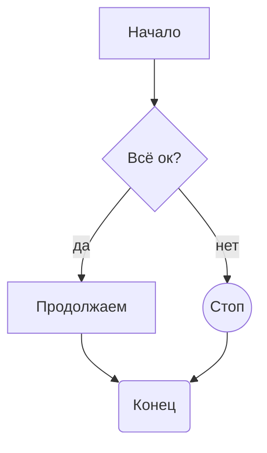
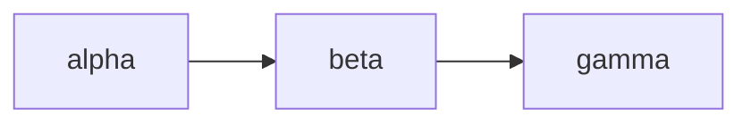
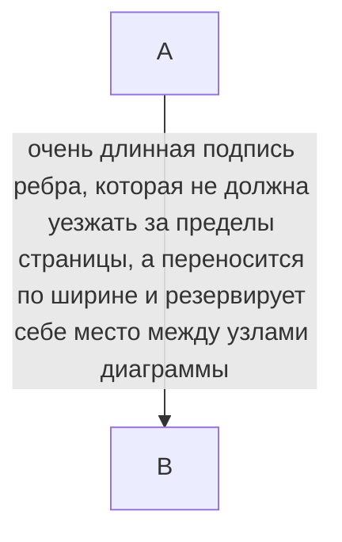
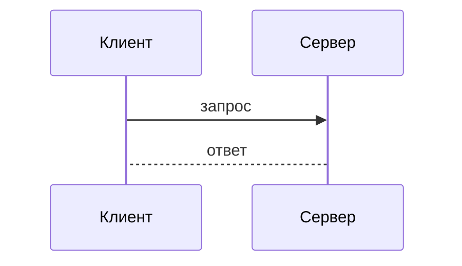

# Диаграммы Mermaid

## Flowchart

```mermaid
graph TD
    A[Начало] --> B{Всё ок?}
    B -->|да| C[Продолжаем]
    B -->|нет| D((Стоп))
    C --> E(Конец)
    D --> E
```

```mermaid
flowchart LR
    alpha --> beta --> gamma
```

```mermaid
graph TD
    A -->|очень длинная подпись ребра, которая не должна уезжать за пределы страницы, а переносится по ширине и резервирует себе место между узлами диаграммы| B
```

## Sequence

```mermaid
sequenceDiagram
    participant C as Клиент
    participant S as Сервер
    C->>S: запрос
    S-->C: ответ
```

## Деградация до кода

```mermaid
gantt
title План работ
```
