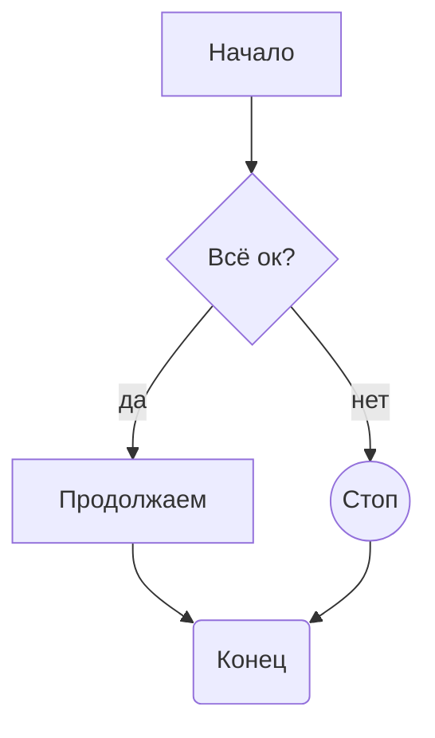
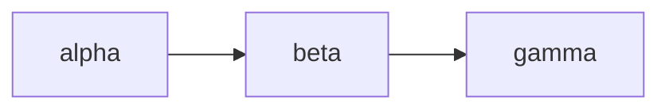
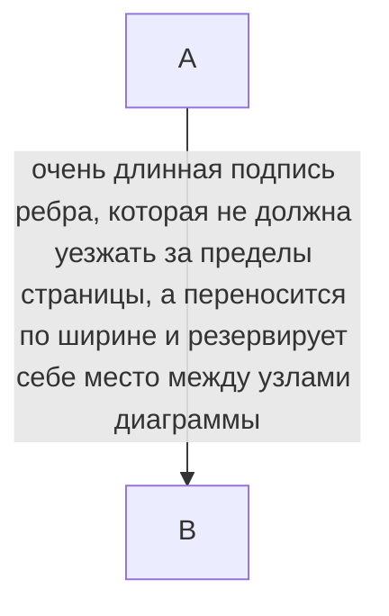
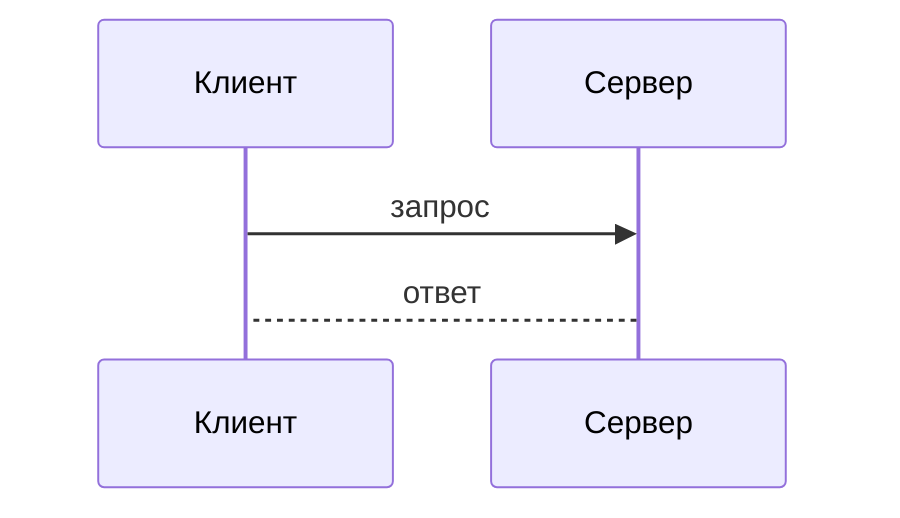
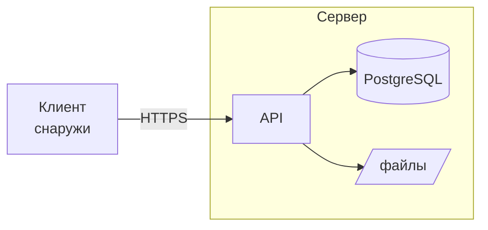
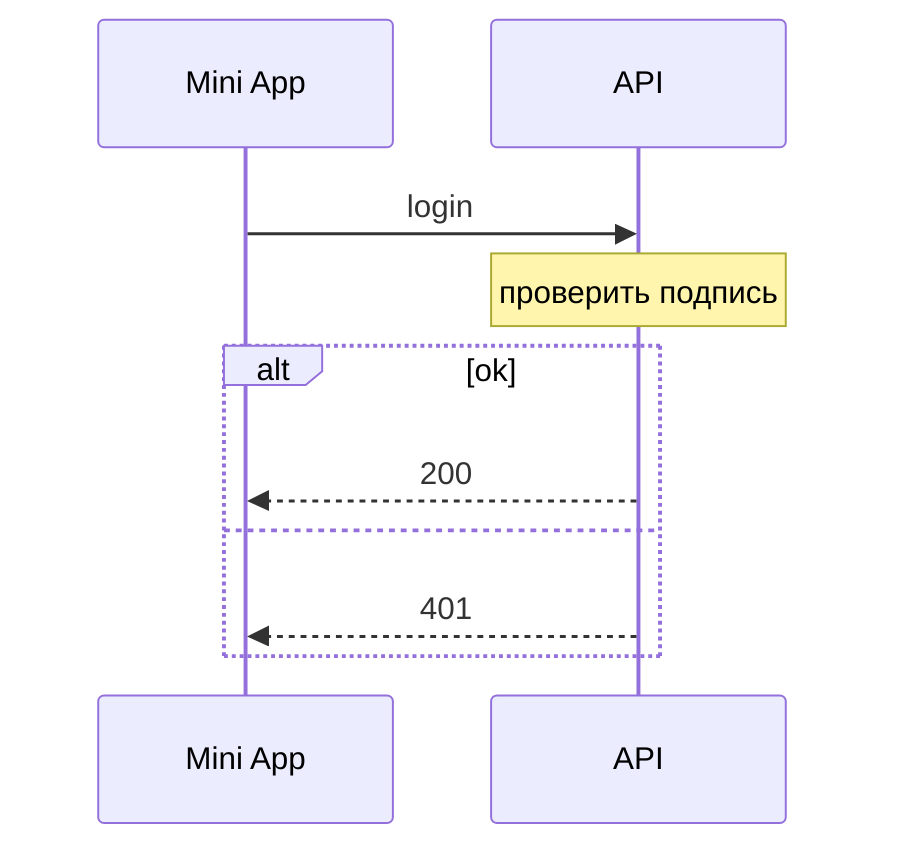
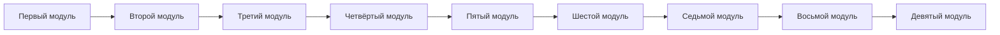
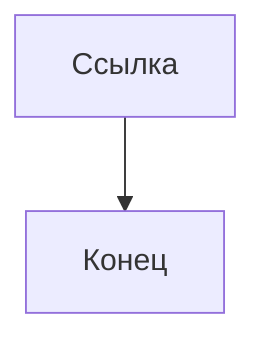

# Диаграммы Mermaid

## Flowchart







## Sequence



## Subgraph, cylinder, note, alt





## Широкая диаграмма на альбомной странице

В книжной полосе набора такой ряд ужался бы до нечитаемого кегля,
поэтому диаграмма выносится на отдельную альбомную страницу.



## Деградация до кода

Нераспознанный тип диаграммы.

```mermaid
totallyNotADiagram
A --> B
```

Внешняя ссылка в выходном SVG запрещена политикой ресурсов (ТЗ §33.3),
поэтому такая диаграмма тоже деградирует до кода.


